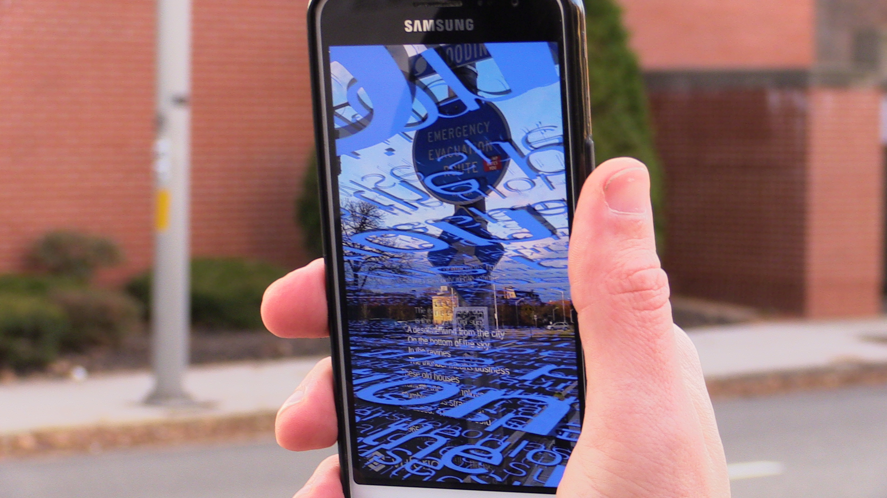

# Climate Reader

A Unity project that builds the mobile app for the piece *Rules Not To Follow About The Weather*, a collaboration with artist Brett Zehner.
The app poetically imagines anticipated sea level increases by immersing the phone's viewscreen in a flood of climate change text, mapped onto a QR code rendered in the style of a hurricane warning sign.
Sirens and warning sounds are stretched into ocean-like ambiances, made glitchy by the tracked movements of the AR software.

## Dependencies

The piece uses the Vuforia SDK to track the hurricane logo target and thereby orient the animations and sounds.

## Credits

Alexander Dupuis: Unity programming, animation, and audio programming

Brett Zehner: Text and audio creation 